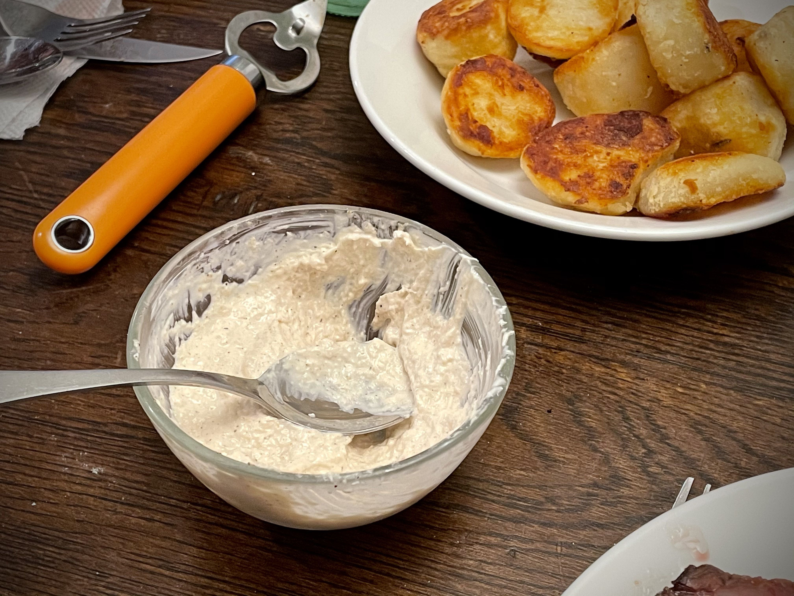
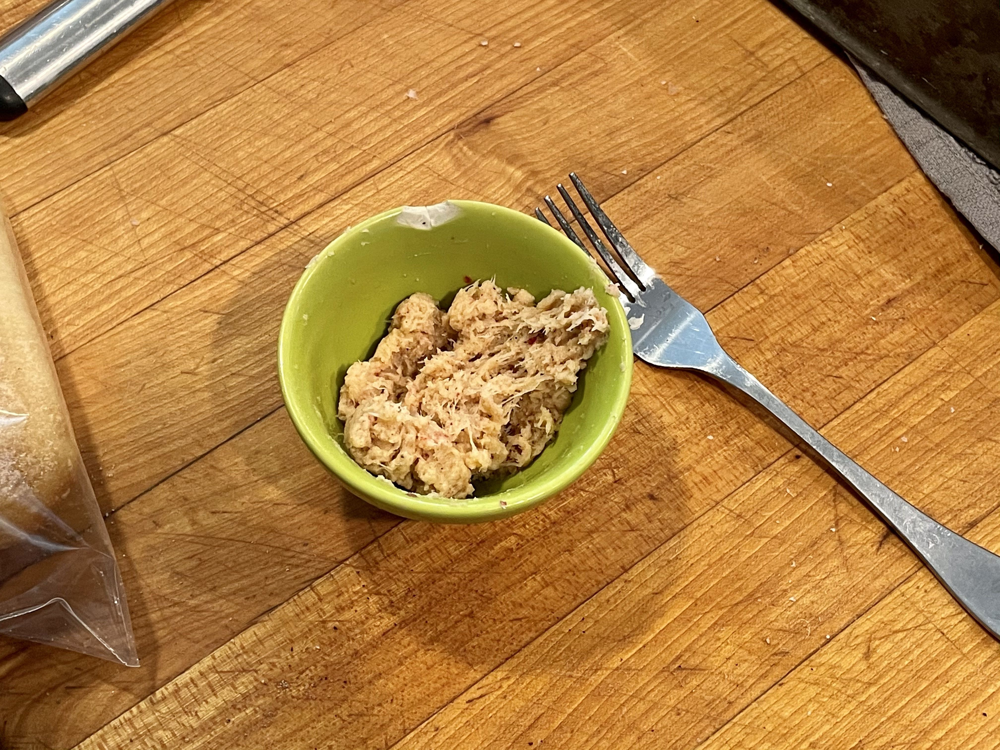
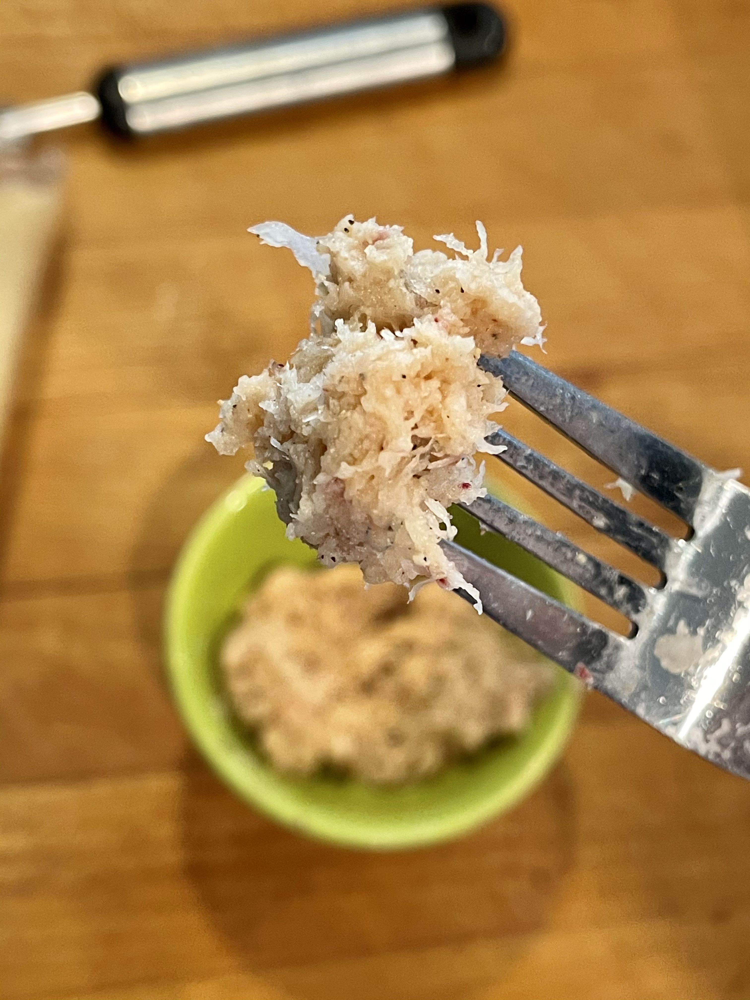
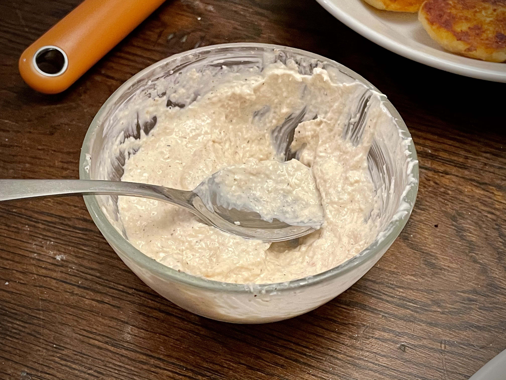
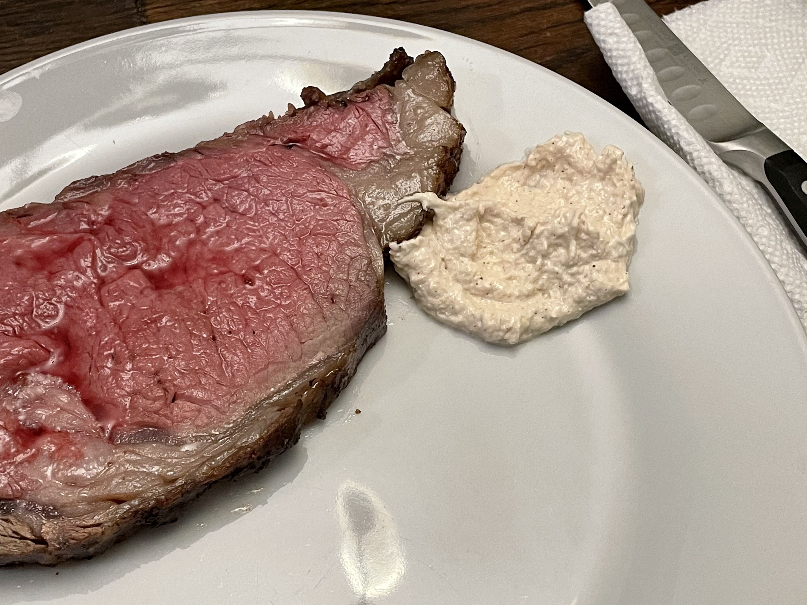

One of my family's Christmas holiday traditions is to enjoy a delicious Prime Rib Dinner feast on christmas night. As is often common, we generally serve horseradish cream with our prime rib and a "jus" style gravy/sauce. 

This horseradish condiment is such a popular hit in our family, that we generally go through multiple bottles of the raw horseradish as we prepare the horseradish cream. We joke about how much we love our horseradish and it has become essential to the family tradition.

Unfortunately this year, on Christmas morning 2020, we realized that we had forgotten to get the bottle of raw horseradish needed to prepare horseradish cream for our dinner feast. All the grocery stores were closed for the day, so there was no where that we could get this stuff.

Not wanting to destroy the tradition, my father took the challenge upon himself to create a worthy horseradish replacement with only what was available in the house.

My dad has always been a miracle maker in the kitchen. In a creative pursuit to save Christmas Dinner, he managed to create a replacement to horseradish that works as a surprisingly close replica to the real stuff.

## Recipe for Horseradish Substitute

1. Radishes _(about 4)_
1. Ground Mustard _(about 1 Tbsp)_
1. Ground Ginger _(about 1 Tbsp)_
1. Finely Ground Peppercorn _(to taste)_
1. White Wine Vinegar _(about 1 tsp)_

### Directions

It is important to remember that these are all approximations. You will want to taste as you go and adjust as needed. But this will serve a good guideline to recreate it yourself.

First start by taking the whole radishes and grating them as fine as possible. We used a microplane, which quickly turned the raw radishes to a pulp. But any zester or grater would do. Just remember to shred or chop it as much as possible to create a pulp-like texture. This is the base for the horseradish substitute and gives it the authentic texture.

**A Note on Skins:** We did some informal tests within the family to see if we should leave the red skins on the radishes or take them off before grating. The concensious was that leaving the red skins on gave it a pepper-ier flavor. So you can leave the skins on or off depending on if you seek that pepper flavor.

Next, we sprinkled in the **Ground Mustard** and **Ground Ginger** as we continued to fold and mix the radish pulp. Sprinkle **Finely Ground Peppercorn** into the pulp until you reach the ideal pepper flavor.

Lastly we incorporate the **White Wine Vinegar** which will elevate the flavors and give it the "zing". It also will work to improve the texture and consistency.

### Horseradish Cream

If you want to make a delicious cream sauce for your steak that delivers a strong bite you can try out some horseradish cream. 

To make it, you simply add equal parts of horseradish to mayonaise and sour cream. Mix it well and serve cold with steak.