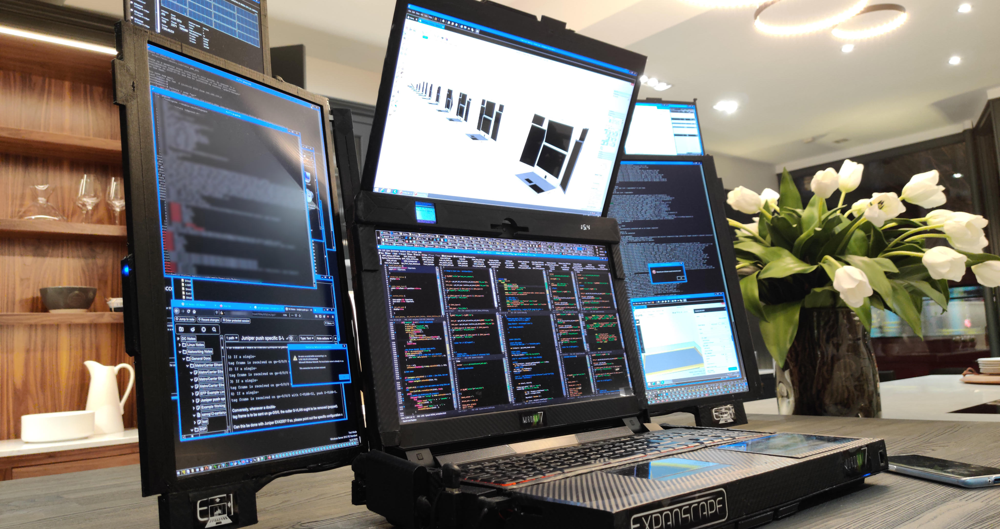
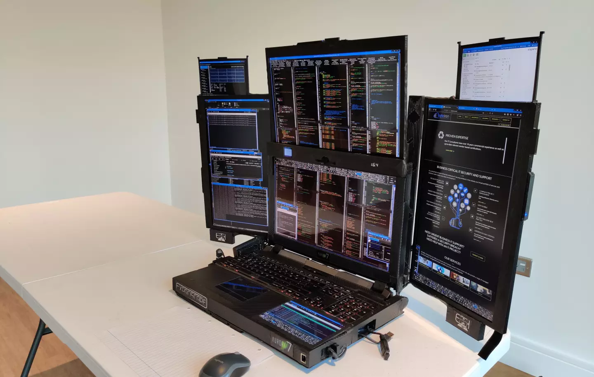
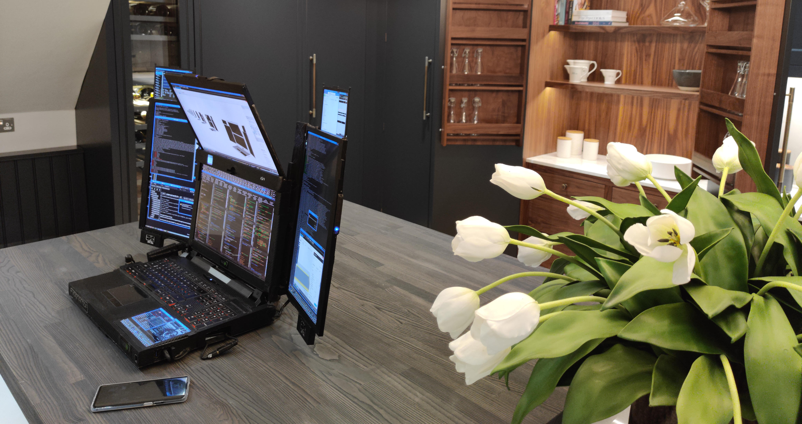
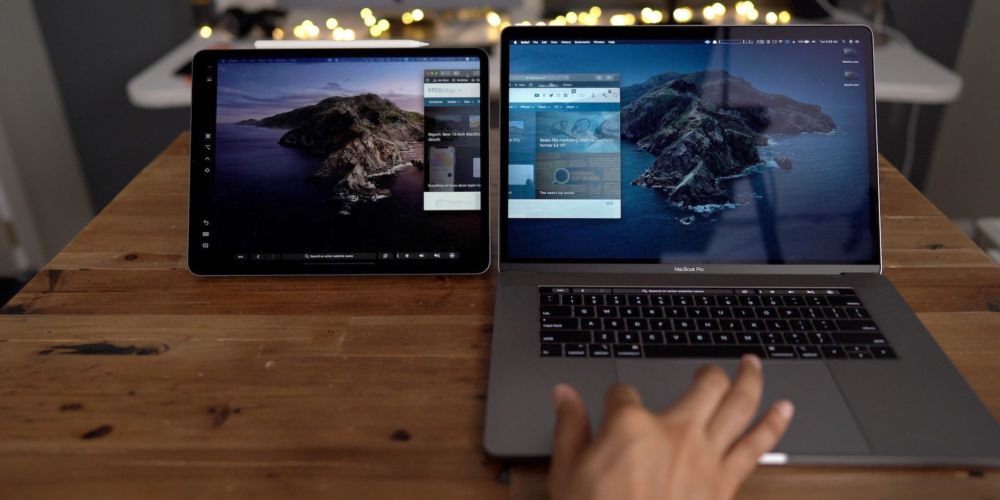
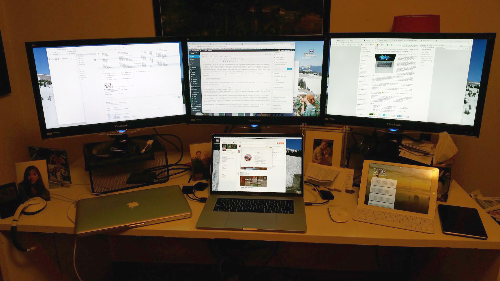

I'm a huge fan of dual monitor workstations. I believe that the dual monitor setup really improves productivity over the single screen setup. A new laptop manufacturer Aurora is seeking to bring this multi-monitor productivity to the laptop space. This sounds like incremental progress at first, we have seen a few other laptops with dual screens at CES. But Aurora seeks to disrupt it all by upping the ante with _even more (than two)_ screens!

Aurora's newest laptop doesn't have two screens, it doesn't have three screens, hell even five screens isn't enough. The Aurora Expanscape A7 is a laptop with **SEVEN FOLDOUT SCREENS** for the ultimate productivity powerhouse...supposedly.

## Expanscape: The Seven Screen Laptop

Let's first look at the laptop before we start discussing the practicality of it for a moment. This laptop has one primary screen where you would expect a screen on any laptop. It then adds a fold-up screen that displays above the primary screen, plus two wings coming off the primary screen that each contain another two screens. Grand total: **seven screens**.

The laptop has four 17.3-inch 4k panels and three 7-inch panels that operate at 1,920 x 1,200 resolution. That is a total of 40,089,600 pixels at your disposal for... "productivity".

### Hardware

All these pixels are ran by an Intel i9 9900K 8-core processor and an Nvidia GTX 1060 series graphics card. The current model has 64GB of DDR4 RAM, which is soon expandable to 128 GB of RAM. For harddrives it comes with 2.5 TB SSD and a 2TB mechanical harddrive, but they are trying to get the storage up to 16 TB of straight SSD storage.

For I/O we have three USB-A ports and one thunderbolt port. It also has HDMI-out, built-in stereo speakers, a built-in subwoofer, 2 MP webcam and a full 104-key backlit keyboard. As you would expect on a beast like this, it has the 802.11ac Wi-Fi and Bluetooth 4.2.

### Size & Battery

Of course all this power and all of these screens have to go somewhere. So that turns this thing into a literal monster of a laptop. In fact, I use the word "laptop" very loosely here. I think "portable computer" might be more appropriate term, this thing isn't sitting on your lap or going in a backpack.

All the screens will fold down into a _compact_ chassis of 20 x 13.3 x 4.3 inches (51 x 34 x 11 cm). It weighs in slightly above 22 lbs (10 kg).

Just for size comparison a Macbook Pro 15" is 13.75 x 9.5 x 0.6 inches (35 x 24 x 1.5 cm) and weighs 4 lbs (1.8 kg). That means that the Aurora A7 laptop is about the same volume as 14 macbook pro 15's and weighs about the same as 5½ macbooks.

Of course the biggest killer of battery life on any laptop are the screens. The Aurora A7 definetely has a battery problem. It has a primary built-in battery of 82,000 mWh PLUS an external batter of 104,000 mWh. Remember that the 22 lbs weight doesn't include the  104,000 mWh external battery. With all those batteries (the internal and external together) you can get "up to an HOUR" of battery life on this thing.

## Why? Do we need a 7-screen laptop?

I sent this to a friend of mine, a laptop device enthusiast, who simply replied to my text saying: "why?"

Why, indeed.

In the world of cool tech gadgets, I don't know that anyone has ever asked for a seven screen laptop. They claim that this was built for developers (ok, that's me), content creators (ok, me again), and data scientists (hmmm, that's also me) who need "lots of display real estate".

So I guess I found the perfect laptop that was built _JUST_ for me. I am a developer, data scientist, and content creator. There aren't a lot of people like me so I would think that this might be the perfect device, built just for someone weird enough as I.

Unfortunately I look at this thing as a funny proof of concept in just how ridiculous of a device can be made. But that is all it is, ridiculous.

Can you imagine taking this 22 lb computer that is 4.5 inches thick (that's half the height of my Macbook Pro 13") into a Starbucks? Then set it up on a table and proceed to unfold 7 screens? I'd also have to pull out my 104,000 mWh external battery pack just to get up to the rated "up to an hour" of battery life. It really is so impractical that it seems like a joke. If this product was announced closer to April I have happily bet on this being an April Fool's joke. 

But this is real and Aurora is taking orders. You can email [enquiries@expanscape.com](mailto:enquiries@expanscape.com) if you are dying to get your hands on one of these.

## Reality Check

In all seriousness I really don't see the point. The point of a laptop is convenience and flexibility. This provides none of that. It doesn't have enough battery life to realistically be used on battery **at all**. It is too heavy and bulky to be carried around. It would take up a whole seat in a car. So its' use is limited. 

I love multi-monitor setups, but the real amazing use-case for someone that needs a laptop with lots of screens is honestly a Macbook. With the 15 inch model you can get all the same power (CPU, GPU, RAM) that the Aurora A7 offers, but in something that is literally 6% the size and weighs 5½ times less. You will have battery for up to 15 hours. The reason I call out the Macbook Pro is that even though it only has 1 built-in screen, it has two cool features that enable it for multi-monitor lovers. 

First it has [sidecar](https://support.apple.com/en-us/HT210380) which allows you to use a iPad Pro as a second screen for your laptop. Since the iPad has its own amazing battery life, the second screen has minimal effect on your battery. This dual monitor setup is actually practical at the airport or starbucks if you needed it. And even though it requires two devices, these are two devices that I always carry in my backpack anyway. Plus both devices together still take up FAR less space and weight that the Aurora A7. 

The other advantage is that you now have two devices that are both amazing individually or can be paired together for this dual monitor setup. I have used this while working during travel and it performs the purpose of a dual monitor setup. It might not be something I would use permenantly but it is a great way to have windows across multiple screens to get that productivity boost. Plus you even get further productivity benefits by being able to use the Apple Pencil on your second monitor (the iPad) while you work from your computer. 

Second, it has thunderbolt/USB-C/USB4 ports. This is great because you can have a 4 monitor setup at the office that simply requires a single cord to plug into your laptop and instantly you have a massive multi-monitor workstation. It even charges your laptop with the same cord and can pass though USB devices. This means that you can have a many-monitor setup at work or home and move between the two. You get the advantage of a many-monitor setup when you get there, with the convenience of a laptop.

The last thing I would question is the productivity of 7 monitors. I largely beleive that you can get nearly double the productivity (maybe even more) by going from one monitor to two. By adding a third monitor you might get a small bump of 5-10%. But adding a 4th, 5th, 6th, or 7th really has diminishing returns after the 2nd monitor that diminishes near-zero past the third monitor. This goes for desktop setups as well. I really don't think much value is gained past three monitors. The productivity advancement is **MASSIVE** between one and two monitors, but the advantage is no where close to linear after that and essentially drops off the cliff. 

A solid 2 monitor setup is all you need. I am saying this as a developer, content creator, and data scientist.

#### References:

1. [Expanscape Homepage](https://expanscape.com/)
1. [Expanscape gives productivity a boost with 7-screen Aurora laptop](https://newatlas.com/laptops/expanscape-aurora-7/)
