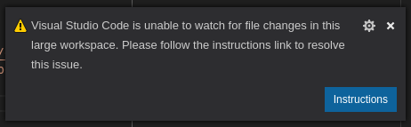
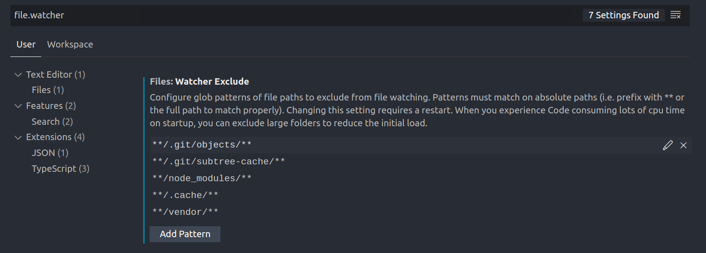

Visual Studio Code (which I usually refer to as VS Code), is my preferred text editor. I have hopscotched around to different text editors every year since I learned to code, but VS Code is the one that seems to have stuck around (for now).

One of the benefits of VS Code is that it works well on all platforms. I currently use it on Mac, Windows, and Linux. Mac is generally my preferred platform, but since my Mac is currently in the shop, I have been happily using Linux for the past few weeks.

If you install VS Code on Linux (I am using [Pop!_OS](https://system76.com/pop)) then you will be happy to see that it works right out of the box. You can install extensions just like on any other platform to customize the experience.

However, you will inevitably run into one problem fairly quickly, you need to manually set up file watchers for VS Code on Linux.

## What are File Watchers?

File watchers are small little daemons that watch the files in your project. They simply keep an eye on if anything changes. They are used for many features in VS Code, but one of the most popular features is letting you know if a file has been committed to version control, modified, or added since the last commit.

I really love this feature (and it is something that my viewers on the DevMarketer Channel constantly ask me about), because it highlights new files (since my last commit) in the workspace file tree green if they are new, and highlights them orange if they are modified, and marks them blue if they are renamed. This is a handy for seeing your modified files at a glance or for spotting those new files that were built with CLI tools or scaffolders.

File watchers are also commonly used by Linters, which check and monitor files for code quality. In my current setup, files that contain syntax errors are marked red in the file tree. File Watchers are required in order to get this functionality.

**So file watchers are cool, trust me you want them working!**

## What's the Problem?

You will discover the problem quickly on any new project in VS Code. As soon as you open up a file that has more than a few files inside of it, you will see a popup message in the bottom right of the screen.



This warning reads:

> Visual Studio Code is unable to watch for file changes in this large workspace. Please follow the instructions link to resolve this issue.

But no worries, this is an easy fix with a few terminal commands and I will show you how to fix it.


## How Do I Fix It?

You can fix it by getting cozy with your terminal. Are you ready? 

The first thing to know is that VS Code is sandboxed inside of its' little electron container on Linux, which is why it can't add these watchers for us. So we are going to set it up at the system level to allow VS Code to monitor our project and give us these cool features.

### 1. Check the Current Number of Watchers

You can see how many watchers you currently have access to with the following command.

```
cat /proc/sys/fs/inotify/max_user_watches
```

This will output probably something like `8192`. No I am not psychic, this is just the default. So unless you have fucked around in here before, this is probably your problem. It is really easy to get more than 8,192 files in a workspace once you start adding in `node_modules`, cache files, a `vendor/` folder, `.git` directory, and so forth. Hell, even VS Code will add its own hidden folder for certain projects (`.vscode`).

So long story short, you need to recruit more minions to watch your files. You have more files than minions. Let's get some minions!

### 2. Increase File Watchers (Get More Minions)

To get more file watchers to watch the additional files, you will need to edit your `sysctl` configuration. This is a system file, you will need administrator access via sudo.

```
sudo nano /etc/sysctl.conf
```

**Note:** I actually use vim, but I usually use nano in tutorials so copy and pasters don't get stuck.

Scroll down to the bottom of this config file and add this line to the very bottom of the file.

```
fs.inotify.max_user_watches=524288
```

This hires more minions to watch your files! Seriously, it increases the number of files you can watch, from a measly 8,192 to a whopping 524,288! That is over half a million. You should be fine with this.

But of course we need to force these changes into effect. So the last thing is to update the changes with this command.

```
sudo sysctl -p
```

And that is it. It should output the line we added to the terminal to confirm that it recognized the change. Bam! Now you can watch 524,288 files!

### 3. Restart VS Code And Enjoy

That is it, you should be good to go. You will need to restart VS Code in order to get the message to dissapear.

### 4. Further Optimization

You might still want to optimize this process further. This is a good idea, because you are using up RAM by having file watchers running. So it is a good idea to make sure they are not being used excessively.

There are two major things to consider. If you are running on limited hardware, then you might want to add less than the maximum file watchers. In our example we enabled up to 524,288 file watchers, which is the maximum. But you can also feel free to limit that to a smaller number.

Each file being watched will take up about 1kB of RAM whenever VS Code is running. So if you have 50,000 files in your project then this is 50MB of RAM. However, if you were using the maximum 524,288 file watchers (which is a massive project), then you could be using as much as 512MB of RAM. On a good development rig this isn't a problem (you probably have 16Gb of RAM), but if you are running limited hardware, then this could be a problem. Just tweak that maximum number as you see fit for your system. But for most of you, if you have anything above 8Gb of RAM, just set it to the maximum.

Last tip, and I recommend this no matter what, is to limit which files are watched. You can tell VS Code not to watch your `.git`, `node_modules` and other folders in the settings. I recommend adding as many of these as you can think of, because they can quickly eat up processes on your computer that add no value. For example you don't need to watch for changes in either of the two folders I just gave as examples, so why waste resources doing so.

To stop VS Code from watching these files, you just need to change a setting.

First go to `File > Preferences > Settings` or press `Ctrl + ,` (`Ctrl + comma`). 



Then in the search bar in the top of the settings tab, just start typing `files.watcher`. It will pull up a section that says "Files: Watcher Exclude". These are all the folders that VS Code will ignore. I recommend adding more here that you know you will never need to watch.

## Wrapping Up

That's it for today's post. It was a bit weird and technical, but the idea is that I like to learn something new everyday. Bit by bit we improve and sharing our knowledge is the best way to remember it. I will probably be posting even more about VS Code or Linux stuff over the next few days while I work in it and tweak it to my preferences.

##### References

[Official VS Code Documentation](https://code.visualstudio.com/docs/setup/linux#_visual-studio-code-is-unable-to-watch-for-file-changes-in-this-large-workspace-error-enospc)